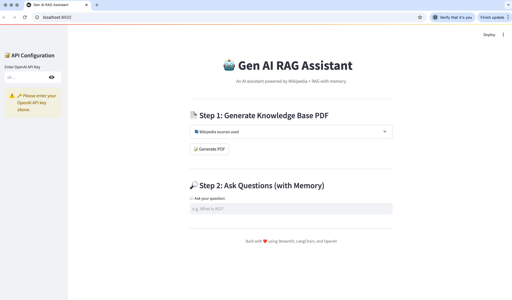
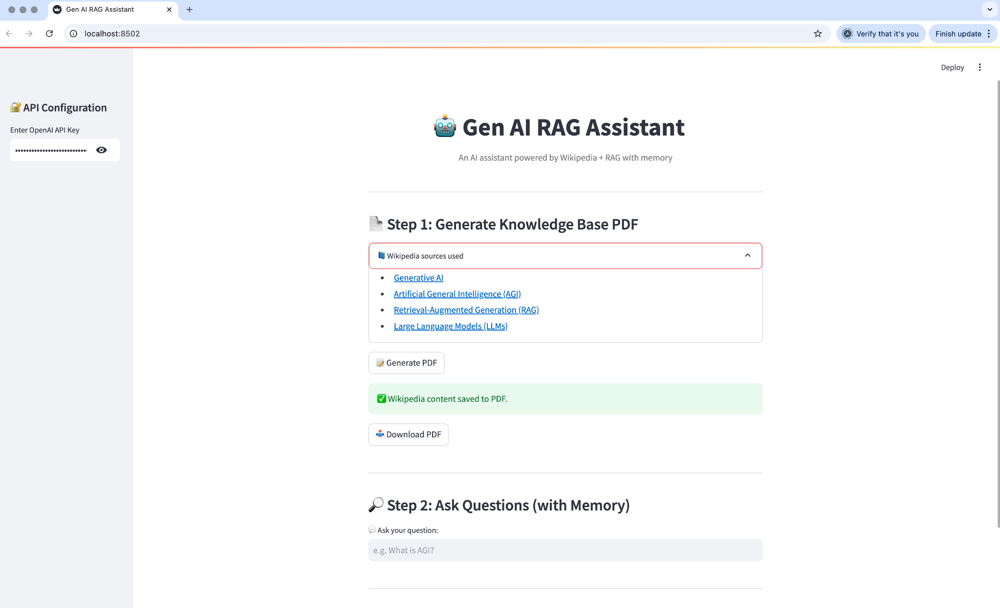

# 🤖 Gen AI RAG Assistant

An AI-powered assistant that combines Wikipedia-based knowledge with RAG (Retrieval-Augmented Generation) and conversational memory. Built using **Streamlit**, **LangChain**, and **OpenAI**.

---

## 🌐 Features

- 🔐 Secure API key entry through sidebar
- 📄 Generate a custom knowledge base by selecting Wikipedia topics
- 🧠 Ask questions with memory-enabled responses using RAG
- 💾 Download the knowledge base as a PDF
- 📚 Powered by real Wikipedia content

---

## 🛠️ How It Works

### Step 1: API Configuration

Enter your OpenAI API key in the sidebar to activate the assistant.



---

### Step 2: Generate Knowledge Base PDF

Choose one or more Wikipedia topics from the dropdown and click **Generate PDF**.



---

### Step 3: Ask Questions (with Memory)

Start asking questions based on the generated knowledge base. The assistant retains the conversation history to enable contextual understanding.


---

## 📦 Installation

1. Clone the repository:
   ```bash
   git clone https://github.com/yourusername/genai-rag-assistant.git
   cd genai-rag-assistant
   ```

2. Install dependencies:
   ```bash
   pip install -r requirements.txt
   ```

3. Run the Streamlit app:
   ```bash
   streamlit run app.py
   ```

---

## 🧰 Tech Stack

- Streamlit (Frontend)
- LangChain (Conversational Retrieval Chain)
- OpenAI (LLM for Q&A)
- FAISS (Vector Store)
- Wikipedia (Data source)

---

## 🖼️ Screenshots Directory

Place the screenshots in a `/screenshots` folder in your project root:

```
screenshots/
├── screenshot_api_key.png
├── screenshot_generate_pdf.png
├── screenshot_chat_memory.png
```

---

## 📄 License

MIT License © 2025
